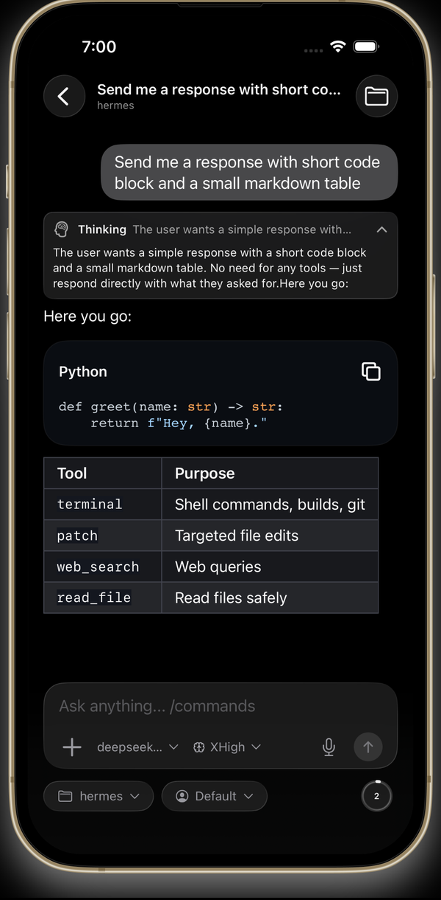
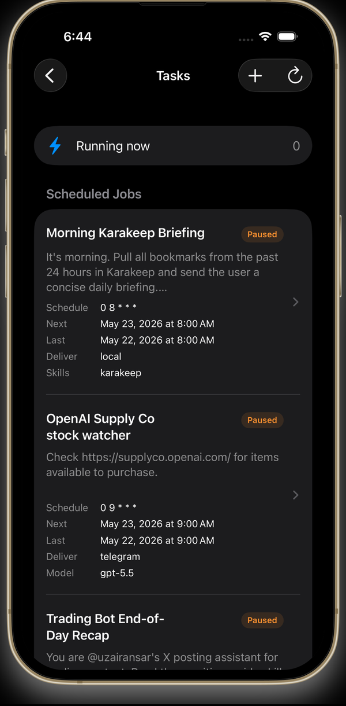
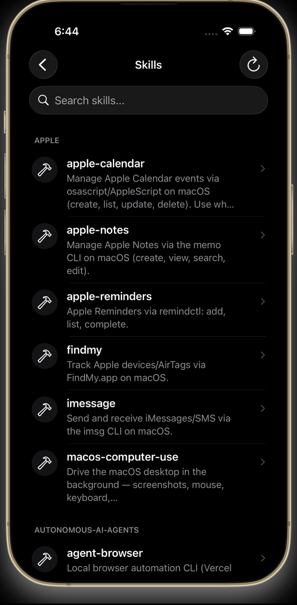

<div align="center">

Run commands in this document from `app/`. Workflows live in `../.github/`.


# Talaria

**Control your self-hosted Hermes agent from your iPhone.**

[](https://developer.apple.com/ios/)
[](https://developer.apple.com/xcode/)
[](../LICENSE)

[Contributing](../CONTRIBUTING.md)

</div>

Talaria is a native SwiftUI iPhone app for a self-hosted [Talaria Web](../web/README.md) server, a mobile cockpit for an AI agent that runs on a machine **you** control. The phone is the control plane, not the compute plane: the agent, its tools, and your data stay on your own hardware.

- **Free.** No subscriptions, no in-app purchases.
- **Private.** No analytics or tracking. Chats and files go only to your server. Optional iCloud sync stores server setups, passwords included, encrypted in your private iCloud database, and optional Relay sees only session titles and run status.
- **Native.** SwiftUI for iOS 18+, not a web wrapper.

## Features

- **Chat** with streamed responses, thinking, and tool-call detail. Pick the model, reasoning effort, workspace, and profile; attach files, photos, or camera shots; dictate by voice; listen to replies; steer, queue, or stop a run; use slash commands and goals.
- **Approvals and clarifications**: answer the agent's approval requests and questions from the chat.
- **Sessions and projects**: browse, search, pin, archive, fork, and export conversations and group them into projects. Cached sessions stay readable offline.
- **Several servers and profiles**: add more than one server, sign in with a password or the server's OIDC provider, and switch agent profiles.
- **Kanban**: manage boards and cards, filter, run bulk actions, and dispatch work to the agent.
- **Tasks**: create, edit, run, pause, and review the agent's scheduled jobs.
- **Skills**: browse and search installed skills and their linked files.
- **Workspace and Git**: browse and preview workspace files; view status and diffs, stage, commit, switch branches, and fetch, pull, or push.
- **Memory**: read and edit the agent's notes, user profile, and soul.
- **Insights**: usage analytics and provider quotas.
- **Live Activities and notifications**: follow a run on the Lock Screen and in the Dynamic Island. With the optional [Talaria Relay](../relay/README.md) (Sign in with Apple), runs update Live Activities and notifications while the app is closed. Relay receives your server's address, each run's session title and status, and this iPhone's push tokens; never transcripts, commands, or server passwords.
- **Widgets**: Home Screen and Lock Screen widgets for provider quotas and pace.
- **Share extension**: send text, links, images, and files from any app into a new chat draft.
- **Siri and Shortcuts**: start a new chat, a voice chat, or a chat in a chosen profile.
- **iCloud sync**: after Sign in with Apple, turn on sync to keep your servers (including saved passwords and custom headers) and selected preferences the same on every iPhone, stored encrypted in your private iCloud database.

<div align="center">
<table>
  <tr>
    <td align="center"><br /><sub><b>Stream responses in real time</b></sub></td>
    <td align="center"><br /><sub><b>Manage scheduled tasks</b></sub></td>
    <td align="center"><br /><sub><b>Browse agent skills</b></sub></td>
  </tr>
</table>

</div>

## Getting started

Talaria is a client only; it does not host or provision a backend. You run [Talaria Web](../web/README.md) next to Hermes Agent on a machine you control.

1. **Run the server.** Follow the [Talaria Web setup](../web/README.md): with Node 24 or newer, `npm install -g @maudecode/talaria-web`, set `HERMES_WEBUI_PASSWORD` in `~/.hermes/.env`, and run `talaria-web ctl start`.
2. **Make it reachable from your phone** (see below).
3. **Connect.** Install Talaria, enter your server URL (for example `https://hermes.example.com`), and sign in with the password or the server's OIDC provider.

Self-hosting the server, securing it, and keeping it reachable are your responsibility.

### Making the server reachable

- **HTTPS through a tunnel or reverse proxy (recommended).** Expose the server through Cloudflare Tunnel or any reverse proxy that terminates real TLS at a hostname you own. On a public hostname the password is your only app-level defense, so set a strong one.
- **Private HTTPS with Tailscale Serve.** Keep the server bound to `127.0.0.1:8787`, then run `tailscale serve --bg 8787` if HTTPS port 443 at the root path is free. Install Tailscale on the iPhone and connect with the `https://…ts.net` URL from `tailscale serve status`. Plain HTTP to a Tailscale `100.64.0.0/10` address also works.
- **Simulator-only testing** can use `http://localhost:8787` when the server runs on the same Mac.

See [remote access](../web/docs/remote-access.md) for more options.

### Troubleshooting the connection

1. The machine hosting Talaria Web is awake.
2. Talaria Web is running and serving `/health` (`talaria-web ctl status`, or `curl https://<your-server>/health`).
3. The tunnel, reverse proxy, or Tailscale route is connected.
4. The server URL and password are correct.

## Building from source

You need Xcode 26 or newer and an iPhone or simulator on iOS 18 or newer. Open `Talaria.xcodeproj` and run the `Talaria` scheme; Swift Package Manager resolves dependencies. From the command line:

```zsh
xcodebuild -project Talaria.xcodeproj -scheme Talaria -destination 'generic/platform=iOS Simulator' build
scripts/test-ios
```

[`DEVELOPMENT.md`](DEVELOPMENT.md) covers the simulator pool, tests, signing with your own team, and local server setup.

## Server compatibility

The app is built and tested against this monorepo's `web/` source. Shared synthetic fixtures live in root `contracts/`, and [CONTRACT_TESTS.md](../CONTRACT_TESTS.md) maps each contract to its disposable HTTP/SSE and Swift check. A deployed server works when it advertises compatible contract versions.

## Documentation

- [`DEVELOPMENT.md`](DEVELOPMENT.md): local development, testing, and signing.
- [`TESTFLIGHT.md`](TESTFLIGHT.md): maintainer-only release and TestFlight operations.
- [`CONTEXT.md`](CONTEXT.md): domain vocabulary.
- [`docs/`](docs): release notes, iCloud setup, the simulator pool, performance budgets, and visual references.
- [`SECURITY.md`](../SECURITY.md): how to report a vulnerability.

## Contributing

Talaria is not accepting outside contributions; see [`CONTRIBUTING.md`](../CONTRIBUTING.md).

## License

MIT; see [LICENSE](../LICENSE).

Talaria Web derives from the public
[`nesquena/hermes-webui`](https://github.com/nesquena/hermes-webui) project;
Talaria is not affiliated with it. Apple, the Apple logo, and App Store are
trademarks of Apple Inc.
