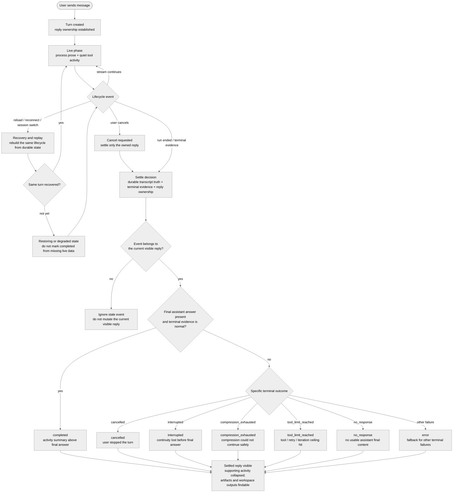

# Live-to-Final Assistant Replies for Long-Running Agent Sessions

- **Status:** Implemented (product contract for the assistant reply lifecycle)
- **Created:** 2026-06-03
- **Updated:** 2026-09-27

## Background: Long-Running Sessions Are The Anchor

This RFC defines the product model for assistant replies in long-running agent
sessions.

Short conversations are still useful sanity checks, but they do not exercise
the hardest browser-agent states. A long-running session can:

- keep the user waiting for minutes,
- make many tool calls,
- produce a long final answer,
- create or update workspace artifacts,
- cross Auto Compression boundaries,
- hit tool-call, retry, or iteration limits,
- lose browser, network, or SSE continuity,
- receive a user cancel or interruption request while startup is still racing,
- switch sessions or reload before the turn settles.

The design should therefore be judged against the long-running case first. A
short conversation should be the same lifecycle with fewer events, not a
separate UI model.

The goal is not to add a Worklog widget, and it is not to make Auto Compression
or duplicate stream ownership the headline. Those are supporting slices and
edge cases. The headline is one coherent assistant reply lifecycle: live work,
supporting activity, terminal outcome, and final answer.

## Product Problem

One chat surface represents several different meanings:

- the assistant's live process text while work is still running,
- tool activity and lifecycle status that support that work,
- recovery or replay state after refresh, reconnect, or session switching,
- terminal outcomes such as cancel, interruption, no response, or tool limit,
- the final answer after the turn settles.

Those meanings have repeatedly competed for the same visual space. Some
long-running sessions feel noisy, some look silent while the agent is working,
some recover into a different shape after reconnect, and some terminal edge
cases can appear completed even when no final answer was produced.

This RFC defines the product semantics every change to reply rendering must
preserve. The server owns them: it stamps every message with its turn's
`_turn_id`, attaches each completed turn's `activity_scene_v1` (ordered rows
under "Worked", `final_answer`, `terminal_state`, `expanded_by_default`, and
`file_changes`) to session detail and terminal payloads, and every terminal
chat frame (`done`, `apperror`/`error`, `cancel`) carries the same
`terminal_state` (`TurnTerminalStateSchema` in `packages/contracts`). Web and
iOS render those fields and derive none of them.

## Scope

### This RFC owns

- The visible lifecycle of one assistant reply from live work to final or
  terminal outcome.
- The boundary between process prose, tool activity, lifecycle status, and the
  final answer.
- Long-running edge-case semantics for Auto Compression, no-final answers,
  tool/iteration limits, cancel/interruption, replay/reconnect/session switch,
  produced artifacts/output handoff, and sidebar/session ownership.

### This RFC does not own

- Pixel-level styling.
- Provider/model selection.
- A backend tool-event schema change such as a shared display-title field.
- A new runtime adapter, runner process, storage format, or SSE protocol.
- Rich artifact rendering, executable HTML, visualization plugins, or Canvas
  editing surfaces. This RFC only owns how produced artifacts remain findable
  from the reply lifecycle.
- The full command semantics for Queue, Steer, Stop-and-send, and Interrupt.

## Product Model

### Lifecycle flow

The lifecycle below is a product-state model. At settle time, the visible reply state should be derived
from durable transcript truth, available terminal evidence, and reply
ownership. A turn should not be marked `completed` only because live activity
or partial assistant prose existed earlier.

### Reply ownership

One visible assistant reply belongs to one user turn and one active run/stream
identity while that run is active.

Requirements:

- A live event should attach to the assistant reply that owns the run.
- A later turn in the same session must not inherit stale live events from an
  older stream.
- A background session can continue running, but its live stream should not
  mutate the visible pane for another session.
- A terminal event should settle the same turn it belongs to, or route through
  a background/error path if the user is no longer viewing that session.
- Sidebar state should not contradict the visible owner. If the sidebar says a
  session is running, opening it should show live work, a restoring/degraded
  state, or an honest terminal state.

### Live phase

While a turn is running, the assistant reply should read as a live process
narrative.

Requirements:

- Process text is the primary timeline.
- Tool activity is visible but visually quieter than process text.
- Tool rows and tool groups are collapsed by default.
- Full commands, arguments, raw output, and large payloads stay behind deeper
  disclosure.
- Thinking/reasoning that is not user-facing progress should not be the only
  visible signal that work is happening.
- The run timer/status belongs with the active live turn, not as a top
  transcript artifact.
- Running-only lifecycle markers are transient.
- Internal recovery/control messages do not become visible chat content.

### Settled phase

When the turn settles, implementation detail should collapse without swallowing
the final answer.

Requirements:

- A compact activity summary appears above the final answer.
- The activity summary is collapsed by default.
- Expanding it reveals readable process history and tool history.
- Raw command/output detail remains behind deeper disclosure.
- The final answer remains ordinary assistant prose below the summary.
- Running-only markers disappear from the settled transcript unless they
  explain a visible error or recovery outcome.
- Very long final answers remain complete and readable. They should not be
  hidden inside the activity summary or replaced by a progress/status artifact.
- Terminal SSE events and terminal recovery fetches carry a bounded recent
  transcript window, not the full durable session. Their `message_count`
  remains the canonical full count, while `_messages_offset` and
  `_messages_truncated` preserve older-message pagination. Normal completion,
  application error, cancel, gateway completion, and recovery use the same
  window contract so settlement work stays bounded as a session grows.

### Activity display and disclosure addenda

The accepted lifecycle now has three presentation strategies over the same
assistant-turn activity data:

- **Compact Worklog** remains the default. While live, process prose stays
  inline and there is no top-level disclosure control. A consecutive sequence
  of two or more reasoning/tool rows shares one nested activity summary until
  prose ends the sequence; a singleton stays inline. When the second row
  arrives, the sequence forms its group. The current group's explanatory label
  tracks the latest activity and shimmers while active; reduced-motion users
  see the same label without animation. Its status (indicator, label and tokens
  per second) is a pill docked above the composer, outside the transcript flow.
  When the turn settles, the top-level Worklog disclosure appears, the same
  activity sequences remain grouped, and the work visibly folds into the
  "Worked" summary from the live turn's height.
- **Transparent Stream** is opt-in and renders the same ordered activity as
  chronological rows. It does not create a second live or settled owner.
- **Final answer only** is opt-in (`chat_activity_display_mode:
  hide_all_activity`).
  It suppresses activity rows without deleting the persisted Anchor scene or
  changing the final-answer owner.

For normal completed turns, the settled Compact Worklog remains collapsed by
default. When a terminal error-family turn has actual Worklog content, the
Worklog defaults open so readable partial work is not hidden behind the error
outcome. The current disclosure error family is `error`, `no_response`,
`degraded`, `connection_lost`, `tool_limit_reached`, and
`compression_exhausted`; cancelled turns and the parent `interrupted` terminal
outcome keep their separate semantics. An explicit user disclosure choice wins
over these defaults and may be restored across a render rebuild.

`degraded` and `connection_lost` are scene-level reconstruction/transport
outcomes (`packages/server/src/sessions/anchor.ts`), not additional canonical
product states in the table below. In this parent
contract, `connection_lost` is the transport-specific Anchor form of an
interruption, while `degraded` is the explicit recovery-state counterpart to the
restoring/degraded path. They use error-family disclosure only because they can
leave readable partial Worklog content without a normal final answer.

These are presentation and disclosure rules only. They do not change reply
ownership, terminal classification, durable transcript truth, or the requirement
that all three strategies converge across live, settle, reload, session switch,
and reconnect.

### Recovery and replay

Refresh, reconnect, session switching, and replay should preserve the same
reply model.

Requirements:

- Recovered sessions rebuild the same live/final structure used during live
  rendering.
- A reattached session must not silently switch to a different visual model.
- If the exact live scene cannot be reconstructed immediately, the UI should
  show an explicit restoring or degraded state instead of an empty running
  shell.
- Replay must be idempotent. It should not duplicate tokens, progress prose,
  reasoning, tool rows, compression rows, or terminal cards.
- Old in-progress browser state must not override durable session truth.
- Recovery/control events stay internal unless they describe a user-visible
  terminal outcome.

### Terminal outcomes

Every turn needs a terminal outcome. A turn without a final answer must not
look like a normal completed answer.

Required product states:

| State | Meaning |
| --- | --- |
| `completed` | The assistant produced a final answer and the turn settled normally. |
| `cancelled` | The user stopped the turn. |
| `interrupted` | Browser, stream, worker, runtime, or network continuity was lost before a final answer was produced. |
| `compression_exhausted` | Context compression could not create enough room to continue safely. |
| `tool_limit_reached` | The run hit a tool-call, retry, or iteration ceiling before a final answer was produced. |
| `no_response` | The provider or runtime returned no usable assistant final content. |
| `error` | Fallback for failures that do not fit the above states. |

The server ships these as `terminal_state` (`TurnTerminalStateSchema`). Copy
can evolve, but these semantic distinctions stay stable in live rendering,
settled rendering, and replay.

When more than one terminal condition applies, the more specific condition
should win over the generic fallback. For example, `cancelled`,
`compression_exhausted`, `tool_limit_reached`, and `no_response` should not be
flattened into a plain `error` only because the turn also failed to produce a
final answer.

## Long-Running Edge Cases

### Auto Compression

Auto Compression is a context lifecycle transition, not a tool call and not
final answer content.

Expected behavior:

- During live work, show compression as quiet transient status.
- When the run continues after compression, converge to a completed compression
  status such as `Context auto-compressed`.
- If one turn crosses the compression barrier more than once, each pass should
  remain understandable without turning compression into the main transcript.
- Do not keep compression status text in the settled transcript unless it
  explains an error or recovery state.
- If compression fails to create enough room, surface `compression_exhausted`
  or another specific terminal outcome instead of normal completion.
- Compression success in the UI does not by itself prove model-facing context
  was pruned; that remains a runtime/context invariant covered by the run-state
  consistency contract.

### Tool-call, retry, and iteration ceilings

Long-running sessions can exhaust tool-call limits, retry budgets, or
iteration ceilings before a final answer is available.

Expected behavior:

- Treat these as explicit terminal outcomes, not as normal completion.
- Preserve the readable work history that led to the limit.
- Keep the final area honest: show that the run stopped because a limit was
  reached rather than inventing a final answer.
- Internal continuation or control prompts used by the runtime must not persist
  as ordinary user-authored transcript content.
- The product state should not depend on whether the limit came from provider
  policy, Hermes Agent iteration budget, or server runtime policy.

### No-final answer and provider failure

Tool-heavy turns can end with tool output, provider failure, or no usable final
assistant message.

Expected behavior:

- Detect the absence of a final assistant answer at settle time.
- Surface a terminal state such as `no_response`, `interrupted`,
  `compression_exhausted`, `tool_limit_reached`, or `error`.
- Do not mark the turn completed only because some assistant/tool activity
  occurred earlier.
- Do not treat internal context-compaction reference material as a final
  assistant answer.

### Cancel and interruption

Cancel is a user-visible terminal action, not just browser cleanup.

Expected behavior:

- If the user cancels before the run fully starts, the backend still reconciles
  against the live worker state where possible.
- If the user cancels after live text, reasoning, or tools have appeared,
  already-visible work should not be silently lost.
- The frontend cancel path should close the SSE source it owns and only clear
  busy state for the stream it actually cancelled.
- A cancelled turn should settle as `cancelled`, not as provider `no_response`.
- A network or worker interruption should settle as `interrupted` or restoring,
  not as normal completion.

### Reconnect and session switch

Long-running work often outlives one browser attachment.

Expected behavior:

- Switching away and back should replay already-streamed process/tool history.
- Refresh and reconnect should preserve the active turn's identity.
- Slow rebuild should be visibly restoring or degraded, not blank.
- Sidebar/session metadata should not point the user at a stale or wrong active
  session.
- Replay should use the same visible lifecycle as live rendering rather than a
  flattened alternate presentation.

### Tool-only or low-prose runs

Some valid long-running turns may produce little or no visible process prose
before the final answer, especially when the model runs a dense sequence of
tools.

Expected behavior:

- The UI should not fabricate assistant prose.
- Tool activity should remain readable enough that the turn does not look
  empty or broken.
- Empty placeholders should be filtered rather than rendered as blank prose.
- If no final answer arrives, the terminal state should explain that outcome
  instead of leaving only a tool list.

### Very long final answers

Long-running sessions can end with a final answer that is itself lengthy.

Expected behavior:

- The final answer remains the primary settled assistant content.
- Supporting activity stays above it and collapsed by default.
- Streaming and settle transitions should not jump the user away from the final
  answer or make the answer look like tool output.
- Any additional collapse, preview, outline, or navigation affordance for very
  long final answers must preserve the full answer as ordinary assistant prose.

### Produced artifacts and output handoff

Long-running sessions often create or update files in the workspace, such as
plans, reports, patches, data files, generated markdown, or other artifacts.
Those artifacts are part of what the user needs from the completed work, even
when they are not the final answer text itself.

Expected behavior:

- Existing artifact surfaces, such as the session Artifacts tab and
  `workspace://` links, remain supporting navigation surfaces rather than
  replacing the final answer.
- If a turn creates or edits workspace artifacts, the settled reply should not
  hide the fact that those artifacts exist or make them impossible to find.
- Reconnect, replay, session switching, cancel, interruption, and no-final
  terminal paths should preserve enough tool/artifact metadata to rebuild the
  same artifact handoff.
- A terminal failure should still distinguish between "no final answer" and
  "some artifacts were produced before the run stopped".
- Large generated files or rich artifact types should route through the
  workspace/artifact preview model instead of being expanded into the main chat
  transcript by default.

### Sidebar and session ownership

Long-running sessions are not only a chat-pane concern. The sidebar and session
metadata help users find active work and later terminal outcomes.

Expected behavior:

- A session row's running indicator should reflect a real active run or a
  clearly restorable state, not stale persisted metadata alone.
- Background completion, cancellation, or failure should be represented without
  stealing the visible pane from the user.
- Session switching should not erase pending live context, in-flight snapshots,
  tool history, or terminal outcome state.
- Maintenance writes, stale cleanup, and background repair should not make old
  sessions look newly active unless meaningful user/assistant activity happened.

### User intervention

During long-running work, the user may queue follow-up input, steer the current
direction, or stop the run and send a replacement.

Expected behavior:

- These controls should not corrupt the live-to-final reply lifecycle.
- This RFC only requires that live-session controls preserve clear ownership,
  terminal outcomes, and replayable state.

## Relationship to other contracts

[`webui-run-state-consistency-contract.md`](webui-run-state-consistency-contract.md)
defines how transcript, context, stream, replay, compression, and session
metadata stay coherent. This RFC defines the product meaning those layers
preserve for long-running assistant replies.

## Review Checklist

Use this checklist when reviewing PRs against this RFC:

- Does the change preserve long-running session readability?
- Does live process text stay primary over tool metadata?
- Are tool details available without becoming the main transcript?
- Does the final answer remain separate from supporting activity?
- Are compression, no-final, tool-limit, cancel, and interrupt outcomes
  classified honestly?
- Does reconnect/session switch rebuild the same reply lifecycle or degrade
  explicitly?
- If the turn produced workspace artifacts, can the user still find them after
  settle, replay, reconnect, cancel, or terminal failure?
- Do internal recovery or control messages stay out of ordinary chat content?
- Does sidebar/session state agree with the visible active or terminal turn?
- Is the PR's slice clear: lifecycle, terminal/recovery, cancel ownership,
  live controls, sidebar/session ownership, or protocol integration?

## Open Questions

Open questions are product choices this RFC does not decide yet.

- Should very long final answers gain additional navigation, outline, or
  preview affordances beyond standard chat transcript behavior? If yes, what
  threshold triggers them and how do they preserve the answer as ordinary
  assistant prose?
- When a turn produces multiple workspace artifacts, should the final answer
  include an automatic artifact summary or navigation affordance, or should the
  product rely on the existing Artifacts tab and explicit `workspace://` links?
- What is the minimum sidebar signal for background long-running sessions that
  have completed, failed, cancelled, or need attention while the user was
  viewing another session?
- Which terminal outcomes should offer inline recovery actions, such as retry,
  continue, inspect details, or reopen from checkpoint, and which should remain
  informational only?
